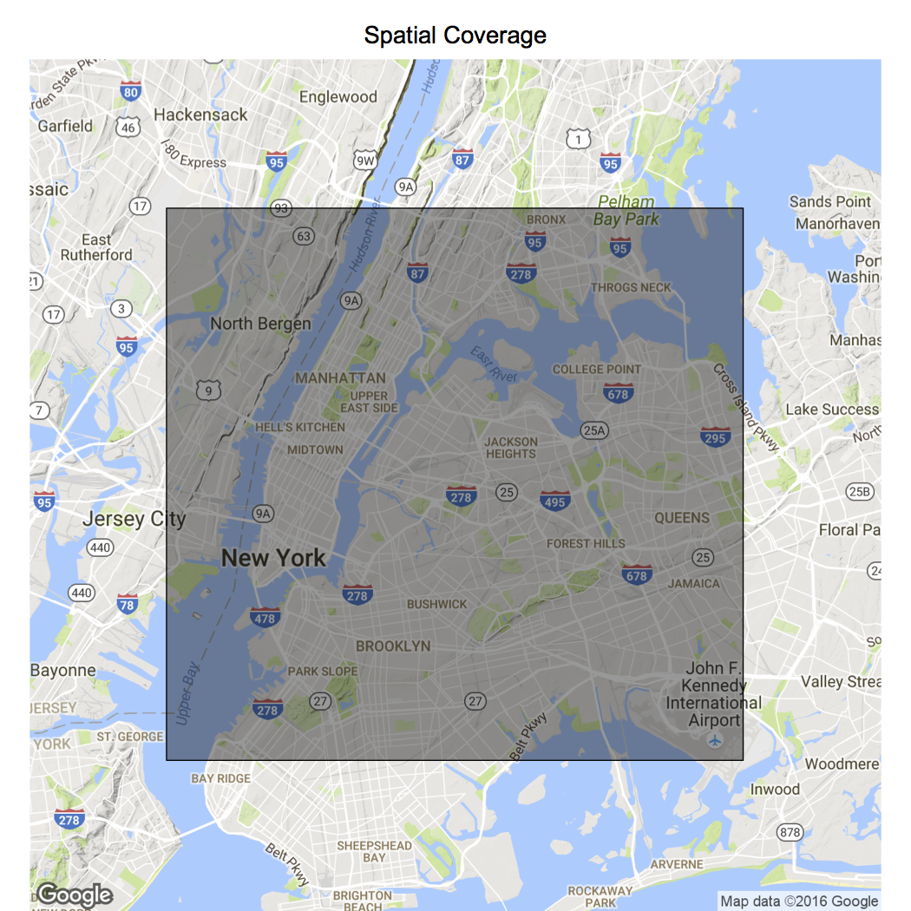
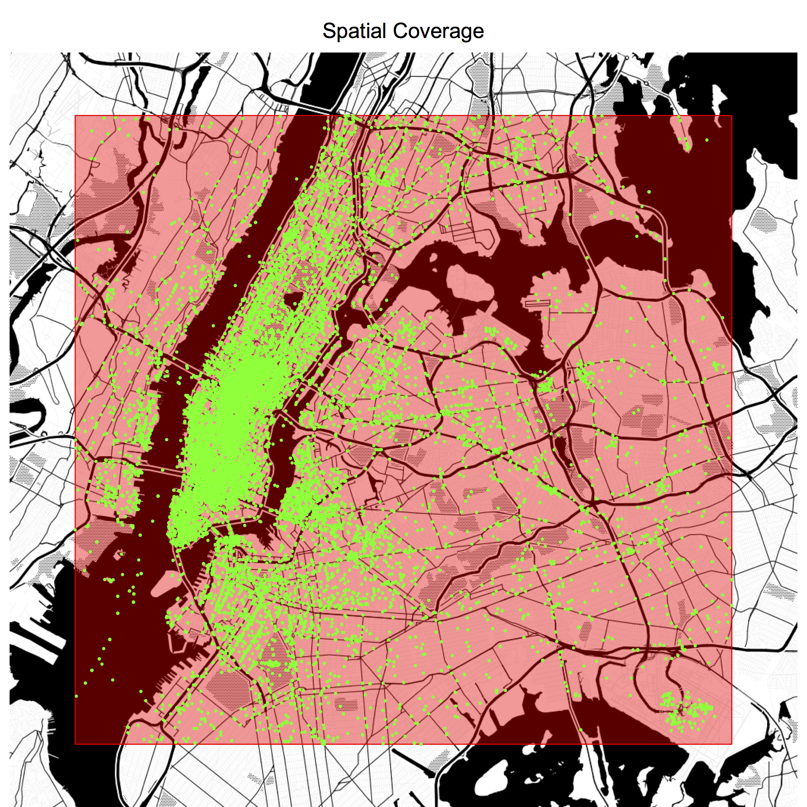
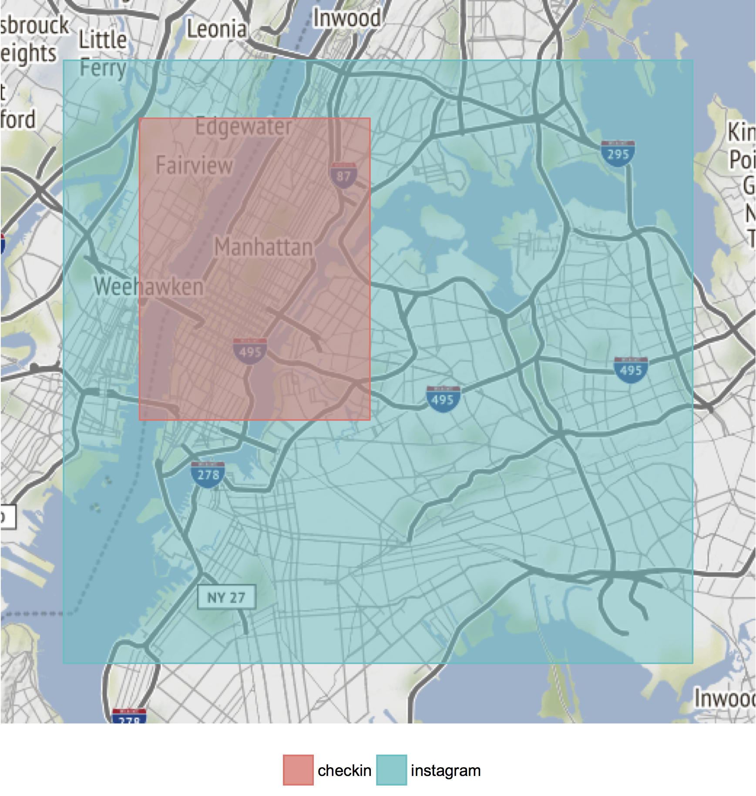
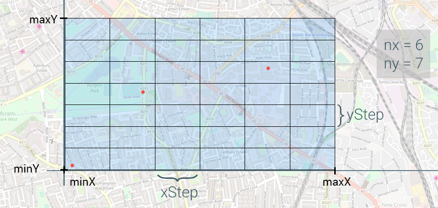
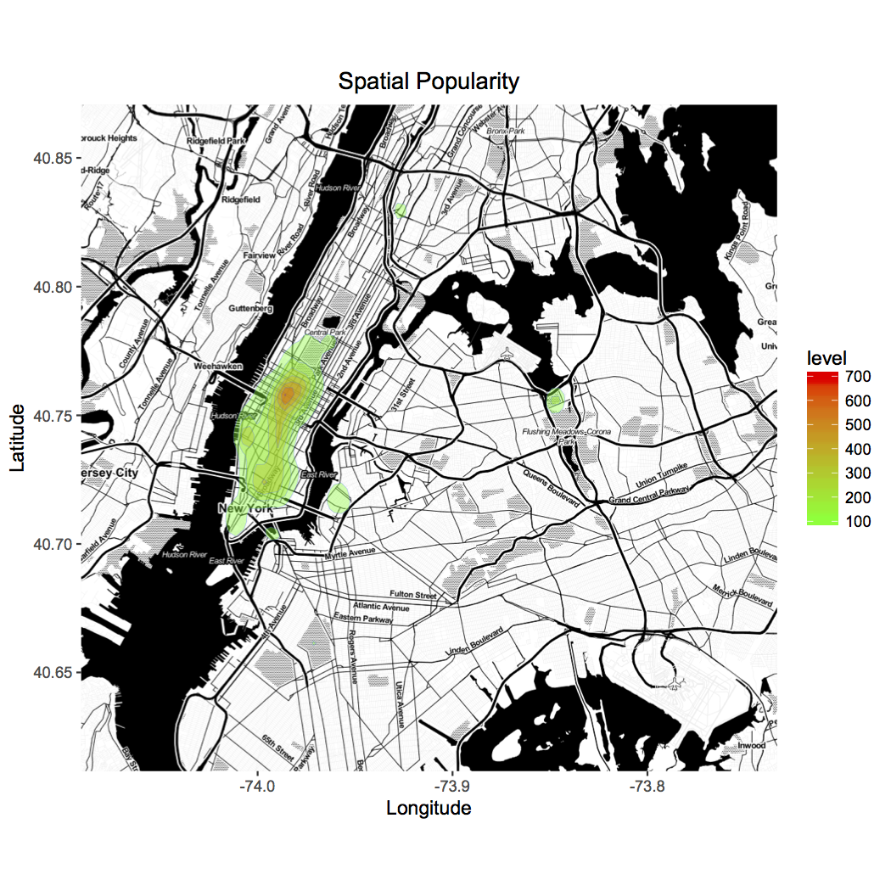
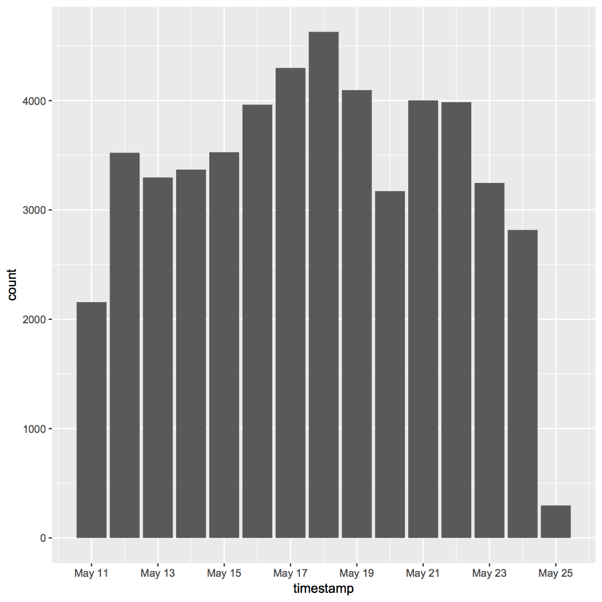
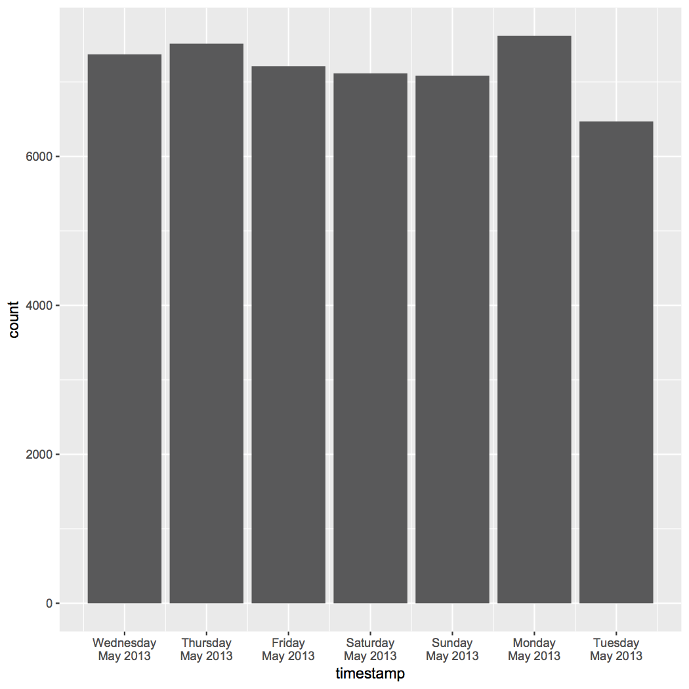
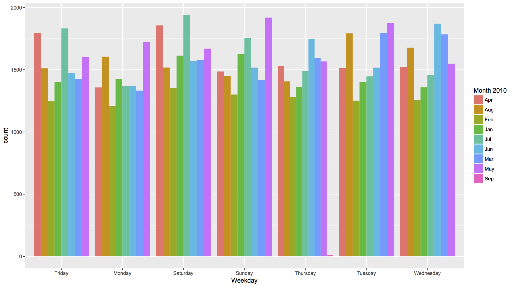
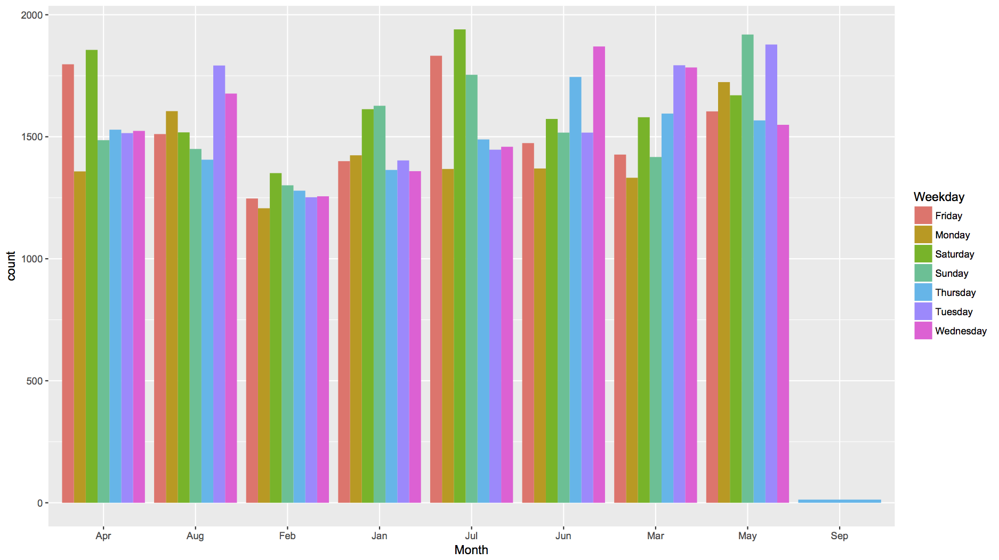
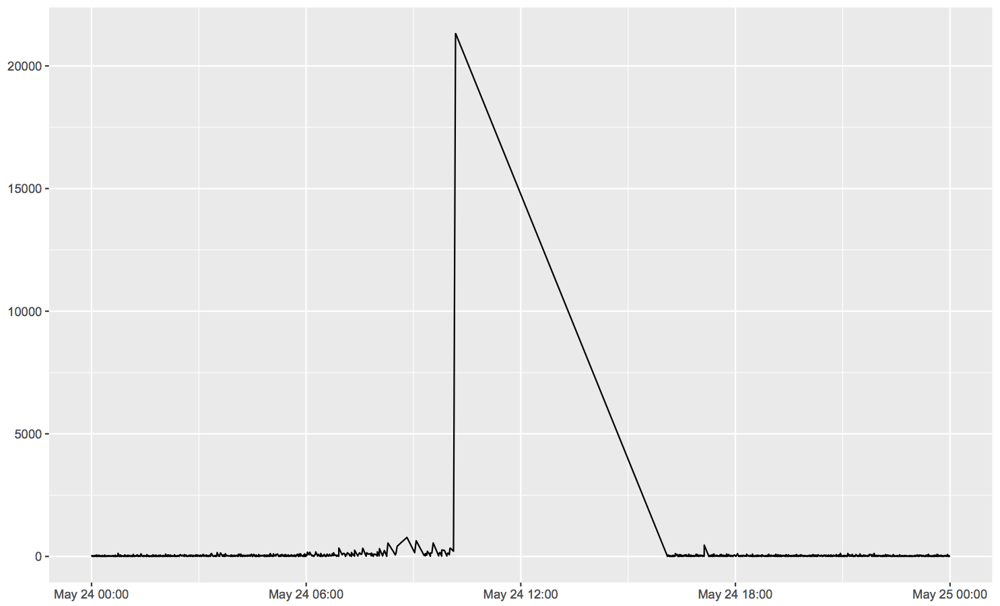

<a name="top"></a>slkit
====

**An R package for property extraction and analysis of multiple Sensing Layers**

The popularisation of smartphones and the increased use of mobile applications allow users to become not only consumers but also data producers. Data shared voluntarily by users using their mobile devices can be related to several aspects, including urban ones. Each type of urban data source, including the ones shared by users, can are considered a type of sensing layer. Data shared by users in a participatory fashion through mobile applications opens unprecedented opportunities to generate useful knowledge, identify and solve issues, and provide new services related to urban aspects. Due to the complexity of urban phenomena and the large volume of data that is typically available, stages such as modelling, preprocessing and analysis of sensing layers are essential efforts on urban computing research. However, those tasks can be time-consuming. To help to tackle that issue,  this study presents an R package intended to give support to researchers regarding decision making and evaluation of sensing layers. It provides functions for property extraction and multilayered analysis which can be customised according to one's project needs, helping to leverage new applications that explore the concept of sensing layers. [[pdf]](slkit_SBRC2017.pdf)

<hr/>

- **[Installation](#installation)**
    - [Examples](#examples)
- **[Property Extraction](#property-extraction)**
  - **[Spatial Properties](#spatial-properties)**
    - [Spatial Coverage - `spCoverage()`](#spatial-coverage---spcoverage)
    - [Spatial Distribution - `spDistribution()`](#spatial-distribution---spdistribution)
    - [Spatial Popularity - `spPopularity()`](#spatial-popularity---sppopularity)
  - **[Temporal Properties](#temporal-properties)**
    - [Temporal Coverage - `tpCoverage()`](#temporal-coverage---tpcoverage)
    - [Temporal Distribution - `tpDistribution()`](#temporal-distribution---tpdistribution)
    - [Temporal Popularity - `tpPopularity()`](#temporal-popularity---tppopularity)
    - [Refresh Rate - `refreshRate()`](#refresh-rate---refreshrate)
- **[Analysis](#analysis)**
    - [STIA](#stia)
- **[Contribution](#contribution)**

<hr/>

## Installation

This package was developed in a way one could edit according to their needs. Therefore it is not a registered official CRAN package, but a single file one can download and edit it when necessary. To import it into your project, simply download the ``slkit.R`` file, insert it into your project folder and import through the ``source`` command.

```
source("slkit.R")
```

#### Examples

For a complete example of slkit use, see [STIA Tutorial](tutorials/STIA). This documentation also provides examples for each property extraction function. The examples use datasets provided on the [data](tutorials/data) folder which simulate real data from social networks and Web APIs  such as Instagram (pictures), Twitter (geolocated tweets), Foursquare (check-ins), [Weather Underground](https://www.wunderground.com) (weather conditions) and [NoiseTube](http://www.noisetube.net) (level of noise).

<a href="#top"></a>

## Property Extraction

A property is any spatial or temporal characteristic of a Sensing Layer that can be measured and compared to different layers. This package presents a set of properties, divided into temporal and spatial, and functions to extract them. The list of properties is not fixed and can be expanded when necessary, according to one's study particularities.

<a href="#top"></a>


### Spatial Properties

These properties quantify the relationship with geographic information.

#### Spatial Coverage - `spCoverage()`

This property represents the area the data is inserted into. The function `spCoverage()` receives the longitude and latitude columns and returns the extreme coordinates (maximum and minimum), forming a bounding box.

##### Parameters
- **lon:** longitude column
- **lat:** latitude column
- **plotBbox:** if TRUE, it plots the bounding box (default is FALSE)
- **colourBbox:** the colour of the bounding box (default is black)
- **plotData:** if TRUE, it also plots the data as points (default is FALSE)
- **colourData:** the colour of the points (default is yellow)
- **source:** source of the basemap. It can be Google Maps ("google"), which is the default, OpenStreetMap ("osm") or Stamen Maps ("stamen")
- **maptype:** character string providing map theme, which depends on the source (default is "terrain")
- **zoom:** map zoom (leave it NULL for auto zoom)

##### Example
Before anything we should import the slkit and a dataset.
```
source("slkit.R")
ig <- read.table("tutorials/data/instagram.dat", header=TRUE, stringsAsFactors=FALSE)
```

**1. `spCoverage(ig$lon, ig$lat)` returns:**
```
     left   bottom     right       top
-74.06077 40.63317 -73.76324  40.84902
```
**2. `spCoverage(ig$lon, ig$lat, TRUE)` returns:**

<a href="img/spCoverage1.png"></a>

**3. `spCoverage(ig$lon, ig$lat, plotBbox=TRUE, plotData=TRUE, source="stamen")` returns:**

<a href="img/spCoverage2.png"></a>

**4. `spCoverage(ig$lon, ig$lat, TRUE, "red", TRUE, "green", source="stamen",maptype="toner-background")` returns:**

<a href="img/spCoverage3.png"></a>

It is also possible to plot the spatial coverage of multiple layers using `spCoverageList()`. The input is a list with named dataframes. It is important that every df has a lon and lat columns.

```
source("slkit.R")
ig <- read.table("tutorials/data/instagram.dat", header=TRUE, stringsAsFactors=FALSE)
ci <- read.table("tutorials/data/checkin.dat", header=TRUE, stringsAsFactors=FALSE)
list <- list(instagram=ig, checkin=ci)
spCoverageList(list, source="stamen")
```
<a href="img/spCoverage4.png"></a>

<a href="#top"></a>

#### Spatial Distribution - `spDistribution()`

This property returns the percentage of the spatial coverage that has data associated with. It first divides the space into rectangles and creates a matrix to represent it. Then it processes all the data points, checking in which rectangle each point is inserted into. It then returns the percentage of rectangles with data. It can also return a plot with the data rectangles coloured.

The figure below illustrates how the spatial coverage is divided into rectangles.

<a href="img/spDistribution1.png"></a>

A high spatial distribution means that the data are well distributed through space, which is positive when evaluating layers.

##### Parameters
- **lon:** longitude column
- **lat:** latitude column
- **nx:** number of horizontal rectangles the area will be divided into
- **ny:** number of vertical rectangles the area will be divided into
- **plot:** TRUE to plot the rectangles with data (default is FALSE)
- **col:** colour of the plot (default is "red")
- **source:** source of the base map. It can be Google Maps ("google"), which is the default, OpenStreetMap ("osm") or Stamen Maps ("stamen")
- **maptype:** character string providing map theme, which depends on the source (default is "terrain")

##### Example

```
source("slkit.R")
ig <- read.table("tutorials/data/instagram.dat", header=TRUE, stringsAsFactors=FALSE)
```
Using the ggmap's crime dataset, `spDistribution(crime$lon,crime$lat,20,20,plot=TRUE)`, we can see that the data is inserted into only 3.75% of the spatial coverage.

<a href="img/spDistribution2.png"></a>

We can also see that the more we increase the resolution, i.e., the number of horizontal and vertical rectangles (nx and ny), the more precise it gets. The pictures below divide the same layer into 100 and 2500 rectangles, returning 98% and 61.96%, respectively.

`spDistribution(ig$lon,ig$lat,10,10,plot=TRUE, source="stamen")`

<a href="img/spDistribution3.png"></a>

`spDistribution(ig$lon,ig$lat,50,50,plot=TRUE, source="stamen")`

<a href="img/spDistribution4.png"></a>

<a href="#top"></a>

#### Spatial Popularity - `spPopularity()`

This property identifies areas that have high data density, hence popular areas. Layers may have high spatial distribution (they cover the majority of the space) but most of the data is clustered in a specific region. In such cases, it might not be a good idea to assume the behaviour perceived in the popular area corresponds to the entire spatial extension of that layer. The output is a density map.

##### Parameters
- **lon:** longitude column
- **lat:** latitude column
- **source:** source of the basemap. It can be Google Maps ("google"), which is the default, OpenStreetMap ("osm") or Stamen Maps ("stamen")
- **maptype:** character string providing map theme, which depends on the source (default is "terrain")
- **colHigh:** colour of the high density area (default is "red")
- **colLow:** Colour of the low density area (default is "yellow")
- **hideMap:** TRUE to only plot the popularity without the background map (default is FALSE)

##### Example

```
source("slkit.R")
ig <- read.table("tutorials/data/instagram.dat", header=TRUE, stringsAsFactors=FALSE)
spPopularity(ig$lon,ig$lat,"stamen","toner","red","green")
```
<a href="img/spPopularity.png"></a>

<a href="#top"></a>

### Temporal Properties

This set of properties is a mechanism to characterise how data behave considering time as a factor.

#### Temporal Coverage - `tpCoverage()`

This property represents the time interval the data is inserted into. The function `spCoverage()` extracts the range from a timestamp (POSIX*) column and returns a vector with the earliest and latest data. It can also return the extent of the interval if `printDiff` is set as TRUE.

##### Parameters
- **column:** timestamp column
- **printDiff:** if TRUE, it prints the time difference (default is FALSE)

##### Example
Before anything, we should source the file and any data set. We also need to convert the timestamp column to a POSIXct or POSIXlt format, since originally its class is character.

```
source("slkit.R")
ig <- read.table("tutorials/data/instagram.dat", header=TRUE, stringsAsFactors=FALSE)
ig$timestamp <- as.POSIXct(ig$timestamp, format="%Y-%m-%dT%H:%M:%SZ")
```
**1.** `tpCoverage(ig$timestamp)` returns:

```
[1] "2013-05-11 12:34:20 BRT" "2013-05-25 01:23:34 BRT"
```

**2.** `tpCoverage(ig$timestamp, TRUE)` returns:
```
Time difference of 13.53419 days
[1] "2013-05-11 12:34:20 BRT" "2013-05-25 01:23:34 BRT"
```
<a href="#top"></a>

#### Temporal Distribution - `tpDistribution()`

This property returns the percentage of the temporal coverage that has data associated with. It first divides the time into intervals, according to a time resolution, and aggregate the original data in each interval. It then returns the percentage of intervals with data. It can also return the dataframes with the total intervals inside the temporal coverage and the intervals in which there are data.

A high temporal distribution means that the data are well distributed through time, which is positive when evaluating layers.

##### Parameters
- **column:** timestamp column
- **res:** time resolution: "yearly", "montly", "daily", "hourly", "minutely" or "secondly"
- **verbose:** if TRUE it also returns the two dataframes with the data intervals used for the percentage calculation

##### Example

```
source("slkit.R")
ig <- read.table("tutorials/data/instagram.dat", header=TRUE, stringsAsFactors=FALSE)
ig$timestamp <- as.POSIXct(ig$timestamp, format="%Y-%m-%dT%H:%M:%SZ")

tpDistribution(ig$time, "yearly")
# [1] 1

tpDistribution(ig$time, "monthly")
# [1] 1

tpDistribution(ig$time, "daily"
# [1] 1

tpDistribution(ig$time, "secondly")
# [1] 0.04162466
```

If we check the temporal coverage we can see that this layer has data from 11-May-2015 to 25-May-2015, so it obvious that the temporal distribution considering yearly or monthly resolution will be 100%. Considering a daily resolution the temporal distribution is still 100% because this layer has data everyday (set verbose TRUE to check that). With the lowest resolution, considering seconds, we get around 4%.

`tpDistribution(crime$time, "hourly")` returns 0.998971. It means that every hour there is at least one crime in Houston, considering this layer with Houston crimes from January 2010 to August 2010.

<a href="#top"></a>

#### Temporal Popularity - `tpPopularity()`

This property identifies periods that have high data density, hence popular times. Layers may have more data during a certain period of the day (more check-ins during the evenings), the week (more traffic incidents on weekdays), and so on. Therefore a temporal popularity property can highlight periods of time that have higher data density than others. The method output is a dataframe with the grouped period and the number of data of such period.

Let's say we have two datasets: one about rubbish level on streets and the other about check-ins. The idea is to try to understand if a great concentration of people can increase the level of street litter (are busy areas dirtier?). The first dataset is a collaborative sensing platform, where users post where they found rubbish on the streets. This layer, in particular, has way more data during the day, since at night when it's dark, it's difficult to spot litter. On the other hand, the second dataset has more data during the night, since people like to check-in when they are going out. In this case, spotting such disparity regarding the temporal popularity the correlation would not be accurate. As alternative one could correlate both layers splitting the day into periods (day and night, for instance) and make a correlation of each period separately.

##### Parameters
- **timestamp:** timestamp column
- **by:** a vector with the parameters to group the data by time frames ("year","mon","mday","hour",min","sec","wday","yday")

##### Example

```
source("slkit.R")
ig <- read.table("tutorials/data/instagram.dat", header=TRUE, stringsAsFactors=FALSE)
ig$timestamp <- as.POSIXct(ig$timestamp, format="%Y-%m-%dT%H:%M:%SZ")
```

Now we can use the output of the method to plot the result. The figure below shows that there is no much daily variation of Instagram posts. The first and last day have both fewer data than the other periods. We can associate that to the collection stage which may have started after the beginning of the 11th and before the end of the 25th.

```
tpPop <- tpPopularity(ig$timestamp, by=c("year","mon","mday"))
ggplot(data=tpPop, aes(timestamp,count))+geom_bar(stat="identity")
```

<a href="img/tpPopularity1.png"></a>

We can also see the popularity regarding the day of the week (although this data set only has 13 complete days of data).

```
tpPop <- tpPopularity(ig$timestamp, by=c("year","mon","wday"))
ggplot(data=tpPop,aes(timestamp,count))+geom_bar(stat="identity")+scale_x_datetime(labels = date_format("%A\n%b %Y"))
```

<a href="img/tpPopularity2.png"></a>

With crimes dataset...

```
tpPop <- tpPopularity(crime$time, by=c("year","mon","wday"))
ggplot(data=tpPop, aes(wday,count,fill=format(timestamp,"%b")))+geom_bar(stat="identity",position = "dodge")+scale_fill_discrete(name="Month 2010")+xlab("Weekday")
```

<a href="img/tpPopularity3.png"></a>

```
ggplot(data=tpPop, aes(format(timestamp,"%b"),count,fill=wday))+geom_bar(stat="identity",position = "dodge")+scale_fill_discrete(name="Weekday")+xlab("Month")
```


<a href="img/tpPopularity4.png"></a>

<a href="#top"></a>

#### Refresh Rate - `refreshRate()`

This property represents how distant the data are in time. It calculates the arithmetic mean of the time difference between consecutive measurements. Besides the mean, the standard deviation and coefficient of variation are also returned. The output is provided in seconds, therefore unit conversion may be needed.

The refresh rate can be extracted generally or by grouping data since it can vary by the hours of the day, days of the week, and so on. This extraction also provides a verbose output which provides a dataframe that can be used to plot the refresh rate through time.

##### Parameters
- **timestamp:** timestamp column
- **by:** a vector with the parameters to group the data by time frames ("year","mon","mday","hour",min","sec","wday","yday")
- **verbose:** if TRUE it also returns the dataframe used in the extraction which can be used in a plot

##### Example
```
source("slkit.R")
ig <- read.table("tutorials/data/instagram.dat", header=TRUE, stringsAsFactors=FALSE)
ig$timestamp <- as.POSIXct(ig$timestamp, format="%Y-%m-%dT%H:%M:%SZ")
refreshRate(ig$timestamp)
# $mean
# [1] 23.21022
#
# $sd
# [1] 104.8416
#
# $cv
# [1] 451.7045
```

This first example shows that our Instagram layer, in particular, has an average of a new post every 23 seconds. But it also shows the deviation is really high, 452% of the mean, which makes us think that there is a discrepancy someday. Let's find out by grouping the data daily.

```
refreshRate(ig$timestamp,by=c("year","mon","mday"))
# $mean
# year mon mday     mean
# 1  2013   5   11 19.07792
# 2  2013   5   12 24.52527
# 3  2013   5   13 26.21086
# 4  2013   5   14 25.44982
# 5  2013   5   15 24.47604
# 6  2013   5   16 21.80111
# 7  2013   5   17 20.09516
# 8  2013   5   18 18.65903
# 9  2013   5   19 21.09377
# 10 2013   5   20 27.23021
# 11 2013   5   21 21.58435
# 12 2013   5   22 21.67704
# 13 2013   5   23 26.60105
# 14 2013   5   24 30.66868
# 15 2013   5   25 16.88851
#
# $sd
# year mon mday        sd
# 1  2013   5   11  23.07966
# 2  2013   5   12  39.48243
# 3  2013   5   13  43.66647
# 4  2013   5   14  50.02142
# 5  2013   5   15  43.67694
# 6  2013   5   16  35.83540
# 7  2013   5   17  34.81631
# 8  2013   5   18  26.05394
# 9  2013   5   19  37.10816
# 10 2013   5   20  55.21159
# 11 2013   5   21  37.54327
# 12 2013   5   22  40.73956
# 13 2013   5   23  89.36487
# 14 2013   5   24 403.24462
# 15 2013   5   25  16.65129
#
# $cv
# year mon mday         cv
# 1  2013   5   11  120.97573
# 2  2013   5   12  160.98673
# 3  2013   5   13  166.59685
# 4  2013   5   14  196.54919
# 5  2013   5   15  178.44774
# 6  2013   5   16  164.37420
# 7  2013   5   17  173.25719
# 8  2013   5   18  139.63180
# 9  2013   5   19  175.91998
# 10 2013   5   20  202.75859
# 11 2013   5   21  173.93745
# 12 2013   5   22  187.93877
# 13 2013   5   23  335.94493
# 14 2013   5   24 1314.84185
# 15 2013   5   25   98.59536
```
Wow, huge output. Let's investigate. Looking only to the grouped mean we are not able to spot any abnormality. But if we check the sd and cv of the day 24-5-2013, jackpot! If we make a plot only of the 24th day we discover there is a data gap between 10:00 and 16:00. It can either mean that there was an error during the data collection or Instagram was down during that specific day (which I doubt).

```
result <- refreshRate(ig$timestamp,by=c("year","mon","mday"),verbose=TRUE)
result.df <- result[["df"]]
day24 <- subset(result.df, mday==24)
day24$hms <- format(day24$timestamp, format = "%H:%M:%S")
day24$hms <- as.POSIXct(day24$hms, format = "%H:%M:%S")
ggplot(data=day24, aes(timestamp, diff))+geom_line()
```

<a href="img/refreshRate.png"></a>

Although it seems that this lack of data is not compromising the entire layer, we can use this information to make decisions (for instance we could have another similar layer without the data gap and this property would probably influence our choice).

<a href="#top"></a>

## Analysis

After analysing each data set individually it is important to see how the selected layers relate to each other. A multilayered analysis intends to attest if the variable represented by one layer have any effect on another layer.

### STIA

SpatioTemporal Intersection Analysis (STIA) aims to measure the level of intersection between different layers regarding spatial and temporal data. The function receives the different layers as parameters and returns an intersection matrix with the percentage of intersection between each layer. This analysis is fundamental previously a multilayered correlation since one must make sure that there is no incongruity between layers (e.g., data of different periods of time or of different cities). [See STIA tutorial for more information.](tutorials/STIA)

<a href="#top"></a>

## Contribution

If you have questions or any suggestion, feel free to open an issue. This tool was implemented thinking about possibilities of use considering previous experience and related work on Sensing Layers, therefore any discussion about improvement is welcomed.