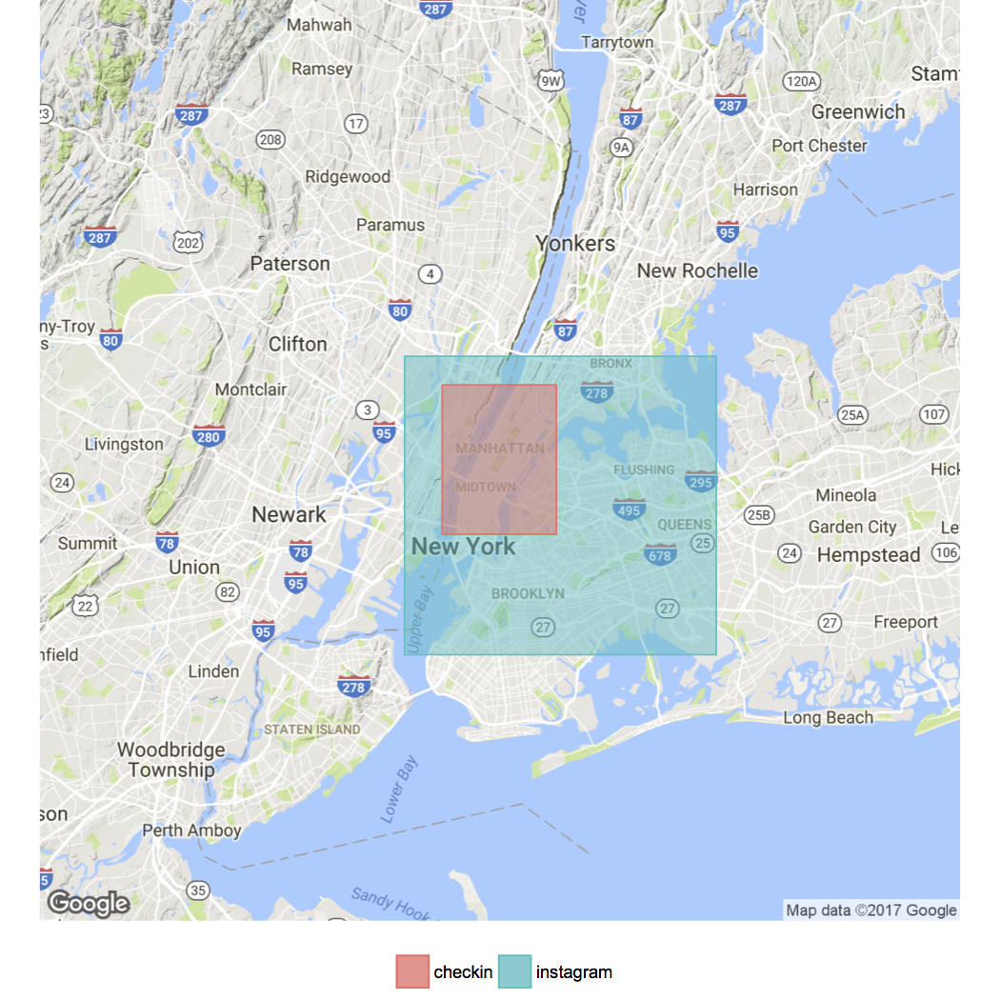

# STIA: SpatioTemporal Intersection Analysis

- [Introduction](#introduction)
- [Prerequisites](#prerequisites)
- [Loading the files](#loading-the-files)
- [Executing the analysis](#executing-the-analysis)
- [Interpreting the results](#interpreting-the-results)
    - [Temporal](#temporal)
    - [Spatial](#spatial)
- [Conclusion](#conclusion)
- [When your layer doesn't have a geometry column](#whenyour)

## Introduction

Let’s say we have a hypothesis. We believe that temperature influences on where people like to go in a city. For example area A is really popular when it’s warm because there are parks or open air pubs; area B, on the other hand, is most popular when it’s chilly. As area A is busier during summer, we assume the level of noise increases as well, right?

So, what we should do is try to correlate temperature, noise level and place popularity in order to test our hypothesis. For this matter, we need at least three different datasets: data about temperature, noise level and popularity. In this example, we are simulating data from Weather Underground (temperature), Noise Tube (noise level), geo-located check-ins and pic posts (place popularity) as data sources. Each one of these will become a different sensing layer.

**But if we want to measure how one variable correlates to another we shall, first, test if the data has spatial and temporal intersection.** It would be a mistake trying to correlate London’s temperature with Munich’s noise level. “Oh right, when it’s really cold in London, the Germans like to party on the street.” The same if we correlated temperature from the 80’s with check-ins from 2016. Basically, we need to make sure the sensing layers belong to the same area (to the same city, for instance) and to the same time. That’s why we need the SpatioTemporal Intersection Analysis (STIA).

## Prerequisites

For this tutorial, we are going to use four Sensing Layers: temperature, noise level, check-ins and geolocated picture posts. Hence the following files will be needed and can be found in the data folder:

```
checkin.dat
instagram.dat
noisetube.csv
weatherunderground.csv
```

## Loading the files

Only after loading the file `slkit.R` we will be able to access all functions implemented on the tool, indispensable to execute any extraction or analysis.

```
# load the main file
source("../../slkit.R")
```
Now we need to load all datasets we are going to use for this tutorial. Each one is in a separate file. A couple of files contain a header, the others don't. It depends entirely on the datasets you will be working, so feel free to load data frames as you please.

```
# load the data frames
ig <- read.table("../data/instagram.dat", header=TRUE, stringsAsFactors=FALSE)
ci <- read.table("../data/checkin.dat", header=TRUE, stringsAsFactors=FALSE)
wu <- read.csv("../data/weatherunderground.csv", header=TRUE, stringsAsFactors=FALSE)
nt <- read.csv("../data/noisetube.csv", header=TRUE, stringsAsFactors=FALSE)
```

All of this data frames contain a timestamp column. But if you check using Instagram data frame, for instance, you can see that the class isn't compatible with Date-Time. `str(ig)` returns:
```
'data.frame':    50382 obs. of  3 variables:
 $ timestamp: chr  "2013-05-11T12:34:20Z" "2013-05-11T12:35:33Z" "2013-05-11T12:37:12Z" "2013-05-11T12:38:01Z" ...
 $ lon      : num  -74 -73.8 -74 -74 -74 ...
 $ lat      : num  40.7 40.6 40.8 40.7 40.7 ...
```
 `ig$timestamp` is the column which contains the timestamp of each post, and its class is character. Therefore we need to convert the column to [POSIXct (or POSIXlt)](https://stat.ethz.ch/R-manual/R-devel/library/base/html/as.POSIXlt.html). Use `str()` to check which column of each data frame you need to convert.

```
# convert the datetime column into the correct class/type
ig$timestamp <- as.POSIXct(ig$timestamp, format="%Y-%m-%dT%H:%M:%SZ")
ci$timestamp <- as.POSIXct(ci$timestamp, format="%Y-%m-%dT%H:%M:%SZ")
wu$EST <- as.POSIXct(wu$EST, format="%d/%m/%Y", "UTC")
nt$timestamp <- as.POSIXct(nt$timestamp, format="%Y-%m-%dT%H:%M:%SZ")
```
Now we are ready to make the analysis we want :)

## Executing the analysis

The STIA can receive two parameters. For temporal intersection, you need to inform a list of all timestamp columns. For spatial it requires a list of a list. The latter has the latitude and longitude columns of each data frame. Both are optional, hence you can run only temporal intersection analysis if you want.

```
tempList <- list(checkin=ci$V2, instagram=ig$V2, weatherUn=wu$EST, noiseTube=nt$made_at)
spatList <- list(checkin=list(lat=ci$V3,lon=ci$V4),instagram=list(lat=ig$V3,lon=ig$V4), noiseTube=list(lat=nt$lat, lon=nt$lng))
```

Note that the temperature layer isn't included in the spatial intersection analysis. It is so because the original dataset didn't have geometry data. But there is an option [when your layer doesn't have a geometry column](#whenyour).

Now we just run the analysis and that's it.

```
STIA(T=tempList, S=spatList)
```

## Interpreting the results

The STIA output is two matrix representing the combinatory intersection. Each element **M(i,j)** represent the percentage of intersection between **i** and **j** over original **i**. For instance, Temporal(2,1) = 0.99999316 says that the intersection between instagram and check-in's data represents 99.999316% of instagram temporal coverage.

```
$temporal
             checkin  instagram weatherUn noiseTube
checkin   1.00000000 0.99992646         1         0
instagram 0.99999316 1.00000000         1         0
weatherUn 0.03718432 0.03718184         1         0
noiseTube 0.00000000 0.00000000         0         1

$spatial
            checkin instagram noiseTube
checkin   1.0000000         1         0
instagram 0.1831869         1         0
noiseTube 0.0000000         0         1
```

 M(i,j) ∈ [0,1]. When equal to zero, it means there is no intersection. When equal to 1, it means the intersection is equal to i.

### Temporal

Analysing temporal data we can see that check-in and instagram are really close since their intersection is almost total. If we use `tpCoverage()` function to calculate the temporal coverage of both we notice that check-in data goes from "2013-05-11 12:32:54 BRT" to "2013-05-25 01:23:26 BRT" and instagram's goes from "2013-05-11 12:34:20 BRT" to "2013-05-25 01:23:34 BRT". I.e., there is only a difference in minutes between these two data frames, hence so close to 1.

Temporal(1,3) = Temporal(2,3) = 1 means that the weatherUn intersects the entire temporal dimension of check-in and instagram's data. On the other hand, the last two represents only 3.7% of weatherUn temporal coverage - see Temporal(3,1) and Temporal(3,2) - since they cover nearly 15 days and WeatherUn data covers the entire year of 2013.

Finally, noisetube doesn't intersect with any of the other three since its data is from 2015 only.

### Spatial

The spatial analysis is really similar to the temporal, although we get to visually see how data is distributed in the space. We can see that spatially check-in and instagram's data have a different behaviour if compared to the temporal analysis. Although 100% of checkin's layer has an intersection with instagram's. The inverse is 18%, which means that only 18% of the area covered by picture posts also have data about check-ins (Fig. 1). NoiseTube, as in the temporal analysis, doesn't intersect with any other and vice-versa.

Figure 1 was generated for instagram and checkin layers, by the function `spCoverageList()` which receives a list of data frames as input and plots the corresponding spatial coverages as polygons. As expected the polygons are almost the same, and the data is from NYC.

```
l1 <- list(instagram=ig,checkin=ci)
spCoverageList(l1)
```



**Figure 1: checkin and instagram spatial intersection**

Now let's try to see why noisetube's data doesn't have spatial intersection by plotting the map.

```
l2 <- list(instagram=ig,checkin=ci, noisetube=nt)
spCoverageList(l2, source="google", maptype="satellite")
```


**Figure 2: checkin, instagram and noisetube spatial intersection**

And then we can see why. It seems NoiseTube's data is from both London and a place in Brazil. And you can see that there are two little red and green rectangles on what it seems to be NYC. Therefore Figure 2 is a confirmation that there is no spatial intersection between noise layer and the others, as STIA presented before.

## Conclusion

With the **SpatioTemporal Intersection Analysis** we were able to identify that we could only make spatiotemporal correlations between check-in and a sector of instagram's data. We also learned that noisetube data isn't anyhow related to the other layers, so we wouldn't use it. The weatherUn's data could also be used but it is necessary to indicate its geometry before any further analysis.

After this previous analysis we conclude that we could not validate our hypothesis with these four layers since there is no spatiotemporal intersection among all of them. But what we could do is correlate place popularity by Foursquare check-ins and 18% of Instagram posts with temperature, within a 15-days data sample, trying to answer questions like: Are Instagram popular places different than Foursquare's? How temperature variation change the way people move in the city?

### <a id="whenyour"></a>When your layer doesn't have a geometry column

[Weather Underground's API](https://www.wunderground.com/history/) offers weather data of a given location, but it doesn't inform the geometry itself. So, in the case we presented here, we discovered that the weather data is from NYC. What we could do is find the geometry of the city from another source (like a shapefile) and work with that.

In NYC, for example, there are areas with no land, so we would need a geometry which excludes the water since we don't have check-ins in the middle of the river. Figure 3 is a good example.


**Figure 3: New York City geometry**

Another thing to pay attention is that by using this approach you are assuming that the temperature (weather conditions or any other data) is the same on the entire area (which isn't true in the real world). But just keep in mind, to not make any fallacious assumption.